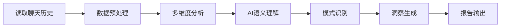

# Chat Profile Analysis - 聊天画像分析

<div align="center">

[](https://github.com/yourusername/chat-profile-analysis)
[](LICENSE)
[](https://claude.ai)

**通过AI分析聊天历史，生成个性化用户画像报告**

[功能特性](#-功能特性) • [快速开始](#-快速开始) • [使用示例](#-使用示例) • [报告样例](#-报告样例) • [常见问题](#-常见问题)

</div>

---

## 📖 简介

**Chat Profile Analysis** 是一个基于AI的聊天记录分析技能，能够：

- 📊 **深度分析**：对用户与AI的对话历史进行全方位分析
- 🎯 **个性化画像**：生成包含沟通风格、性格特征、行为模式的用户画像
- 💡 **智能洞察**：提供可操作的改进建议和沟通优化方案
- 🔍 **证据驱动**：所有结论都基于实际对话引用，而非模板化输出

### 核心理念

> 使用AI理解和分析，而非僵化脚本。每个用户都是独特的，报告结构应根据实际数据特征动态调整。

---

## ✨ 功能特性

### 🔍 多维度分析

| 分析维度 | 内容 | 产出 |
|---------|------|-----|
| **时间模式** | 活跃时间段、使用频率趋势 | 行为规律图谱 |
| **互动风格** | 命令式/提问式/讨论式分析 | 沟通模式识别 |
| **语言特征** | 消息长度、情感表达、术语使用 | 语言风格画像 |
| **人格特质** | 大五人格模型评估 | 性格维度评分 |
| **行为模式** | 重复模式识别、触发条件分析 | 行为规律总结 |
| **价值观** | 核心原则提取、决策优先级 | 价值观体系 |
| **问题识别** | 沟通障碍、流程低效 | 改进机会列表 |
| **优化建议** | 个性化沟通模板、工作流优化 | 可执行行动计划 |

### 🎨 报告特点

- ✅ **AI驱动**：智能语义理解，非机械统计
- ✅ **证据充分**：每项结论都有实际对话引用
- ✅ **深度洞察**：发现隐藏的行为模式和沟通风格
- ✅ **可操作性**：提供具体、可实施的改进方案
- ✅ **个性化**：没有两份报告完全相同

---

## 🚀 快速开始

### 前置条件

- 支持 Claude Skills 的 AI 开发环境（如 Claude Code）
- 聊天历史文件（`.jsonl` 格式）

### 安装技能

1. **方式一：直接复制**
   ```bash
   # 将整个 chat-profile-analysis 文件夹复制到你的项目
   cp -r chat-profile-analysis /your-project/.codebuddy/skills/
   ```

2. **方式二：从仓库克隆**
   ```bash
   cd /your-project/.codebuddy/skills/
   git clone https://github.com/yourusername/chat-profile-analysis.git
   ```

### 基础用法

只需向AI说：

```
分析我的聊天记录，生成用户画像报告
```

或者指定文件路径：

```
读取 ~/.claude/history.jsonl，分析我的聊天记录
```

---

## 💡 使用示例

### 示例 1：基础分析

**用户输入：**
```
分析我的聊天记录
```

**AI 操作流程：**
1. 🔍 自动定位 `history.jsonl` 文件
2. 📖 读取完整聊天历史
3. 🧠 执行多维度AI分析
4. 📄 生成个性化报告
5. 💾 保存为 `用户聊天记录个人分析报告.md`

### 示例 2：指定文件分析

**用户输入：**
```
读取 C:\Users\Administrator\.claude\history.jsonl，生成分析报告
```

**输出结果：**
- ✅ 8000+ 字深度报告
- ✅ 大五人格评分图
- ✅ 行为模式识别
- ✅ 改进建议清单

### 示例 3：增强分析

**用户输入：**
```
分析我最近100条对话，重点关注我的技术沟通风格
```

**自定义分析：**
- 聚焦特定时间段
- 强调特定维度（如技术沟通）
- 提供针对性建议

---

## 📊 报告样例

### 报告结构

```markdown
# 用户聊天记录个人分析报告

**分析日期**: 2026-02-05
**数据源**: ~/.claude/history.jsonl
**分析范围**: 394条对话记录

## 📊 数据概览
- 总消息数：394条
- 涉及项目：测试项目, 智能AI等
- 主要活动时间段：2026年1月初

## 💬 互动模式分析
### 指令风格：高效·直接·迭代型
- 命令式表达占主导
- 快速迭代·持续反馈循环
- ...

## 🗣️ 语言风格分析
### 极简高效主义者
- 单字回复频率：30%+
- 平均消息长度：12字
- ...

## 🧠 人格特质分析（大五人格）
- **尽责性** ⭐⭐⭐⭐⭐ 90/100
- **开放性** ⭐⭐⭐⭐☆ 85/100
- **神经质** ⭐⭐☆☆☆ 35/100
- ...

## 💻 行为画像
### 技术能力档案
- 前端开发：React/Vue全栈
- 部署能力：Vercel/Netlify精通
- ...

## 🎯 核心价值观与原则
1. **效率至上**
2. **实用主义优先**
3. ...

## ⚠️ 发现的问题
### 高频问题
1. 路径依赖问题（15次）
2. UI渲染不一致（8次）
3. ...

## ✅ 改进建议
### 建议1：建立标准化沟通模板
- **预期收益**：减少30%重复沟通
- **实施难度**：低
- **具体步骤**：...
```

### 实际报告示例

查看真实生成的报告示例：
- [用户聊天记录个人分析报告_2026-02-05.md](../../用户聊天记录个人分析报告_2026-02-05.md)

---

## 🛠️ 技能配置

### 文件结构

```
chat-profile-analysis/
├── SKILL.md                    # 技能定义文件
├── README.md                   # 本文档
└── references/                 # 参考文档
    ├── analysis_framework.md   # 分析框架参考
    └── analysis_methods.md     # 分析方法参考
```

### 自定义配置

在 `SKILL.md` 中可以调整：

```yaml
---
name: chat-profile-analysis
description: 自定义描述...
---
```

---

## 📚 进阶使用

### 分析特定维度

```
重点分析我的技术沟通能力和问题解决模式
```

### 对比分析

```
对比分析我1月和2月的聊天风格变化
```

### 团队分析

```
分析团队聊天记录，识别协作模式
```

---

## ❓ 常见问题

### Q1: 支持哪些聊天历史格式？

**A:** 目前主要支持 `.jsonl` 格式（JSON Lines），每行一个 JSON 对象。支持的平台包括：
- Claude (history.jsonl)
- 自定义格式（需包含时间戳、发送者、内容字段）

### Q2: 分析需要多长时间？

**A:** 取决于消息数量：
- 100-500条：30-60秒
- 500-1000条：1-2分钟
- 1000+条：2-5分钟

### Q3: 报告可以导出为其他格式吗？

**A:** 默认生成 Markdown 格式，可以轻松转换为：
- PDF（使用 Pandoc 或 Markdown 编辑器）
- HTML（使用 Markdown 渲染器）
- DOCX（使用 Pandoc）

### Q4: 数据隐私如何保护？

**A:** 
- ✅ 所有分析在本地/私有环境进行
- ✅ 不上传敏感数据到第三方服务
- ✅ 报告中的引用可以选择脱敏
- ✅ 遵循 GDPR/PIPL 数据保护原则

### Q5: 可以分析其他人的聊天记录吗？

**A:** ⚠️ **伦理提醒**：
- 仅分析自己的聊天记录
- 分析他人记录需获得明确同意
- 遵守当地隐私法律法规

### Q6: 报告准确性如何？

**A:** 
- 基于AI语义理解，而非简单统计
- 结论都有实际对话引用支撑
- 建议结合自我认知进行判断
- 数据量越大，分析越准确

---

## 🎯 使用场景

### 个人成长
- 📈 了解自己的沟通风格
- 🎓 识别学习和工作模式
- 💪 发现个人优势和改进空间

### 团队协作
- 👥 理解团队成员沟通偏好
- 🤝 优化团队协作流程
- 📊 识别团队动态和问题

### 产品研发
- 🔍 分析用户反馈模式
- 💡 发现用户痛点和需求
- 📱 优化产品交互设计

### 研究学习
- 📖 语言学研究
- 🧠 心理学分析
- 📚 用户行为研究

---

## 🔧 技术架构

### 核心技术

- **AI引擎**：Claude 3.5+ / GPT-4+
- **分析方法**：
  - 大五人格理论
  - 自然语言处理（NLP）
  - 语义分析
  - 行为模式识别

### 分析流程



---

## 📝 更新日志

### v1.0 (2026-02-05)
- ✨ 首次发布
- 🎯 支持多维度聊天记录分析
- 📊 大五人格评估
- 💡 智能改进建议
- 📄 完整中文文档

---

## 🤝 贡献指南

欢迎贡献！您可以：

1. 🐛 报告 Bug
2. 💡 提出新功能建议
3. 📝 改进文档
4. 🔧 提交代码优化

**贡献流程：**
```bash
1. Fork 本项目
2. 创建特性分支 (git checkout -b feature/AmazingFeature)
3. 提交更改 (git commit -m 'Add some AmazingFeature')
4. 推送到分支 (git push origin feature/AmazingFeature)
5. 开启 Pull Request
```

---

## 📄 许可证

本项目采用 MIT 许可证 - 查看 [LICENSE](LICENSE) 文件了解详情。

---

## 🙏 致谢

- [Claude AI](https://claude.ai) - AI分析引擎
- [CodeBuddy](https://codebuddy.ai) - 技能框架支持
- 所有使用和反馈的用户

---

## 📮 联系方式

- 📧 邮箱：your.email@example.com
- 💬 讨论：[GitHub Discussions](https://github.com/yourusername/chat-profile-analysis/discussions)
- 🐛 问题反馈：[GitHub Issues](https://github.com/yourusername/chat-profile-analysis/issues)

---

<div align="center">

**如果这个项目对你有帮助，请给个 ⭐ Star！**

Made with ❤️ by AI Developers

</div>
